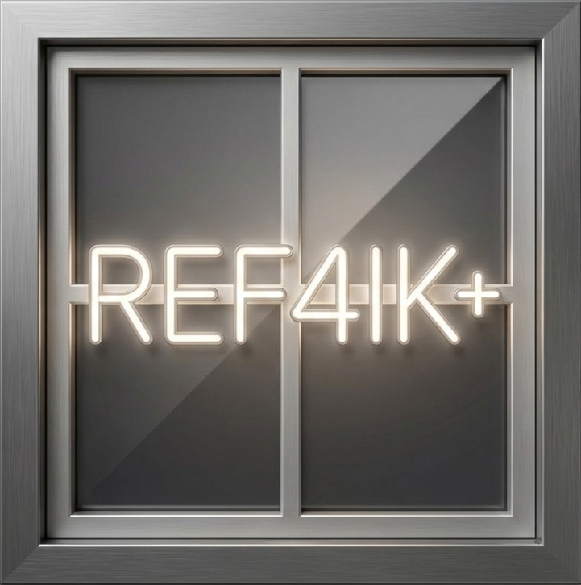

# Winlator REF4IK+

<p align="center">
  
</p>

A patched build of **Winlator Bionic** by the REF4IK dev team, with self-hosted components, GOG/Epic/Amazon game store integrations, and a pre-configured setup so everything works out of the box.

---

## Credits

This project is built entirely on top of the work of the **REF4IK dev team**.

| | |
|---|---|
| **Base APK** | [Winlator Bionic REF4IK mod](https://github.com/REF4IK/Components-Adrenotools-) by REF4IK |
| **Components** | [REF4IK/Components-Adrenotools-](https://github.com/REF4IK/Components-Adrenotools-) · [REF4IK/Components-](https://github.com/REF4IK/Components-) |
| **Additional components** | [Arihany/WinlatorWCPHub](https://github.com/Arihany/WinlatorWCPHub) · [ziad9267/Winlator-Contents](https://github.com/ziad9267/Winlator-Contents) · [de0ver/Components-for-Wine](https://github.com/de0ver/Components-for-Wine) · [slaker222/wcp-for-winlator](https://github.com/slaker222/wcp-for-winlator) |
| **Store integrations** | Ported from [Ludashi-plus](https://github.com/The412Banner/Ludashi-plus) |
| **Winlator** | Original project by [brunodev85](https://github.com/brunodev85/winlator) |

All credit for the underlying emulation, Wine integration, and component ecosystem belongs to the original authors. This repo only provides patched builds and self-hosted mirrors.

---

## Download

Get the latest APK from the [Releases](https://github.com/The412Banner/REF4IK-Banner/releases/latest) page.

> Only install from the **Releases** page. Do not install CI artifacts.

---

## What's Different

### App
- **App name** set to `Winlator REF4IK+`
- **Custom app icon** (ref4ik.png) across all screen densities
- **Default components URL** points to this repo's self-hosted mirror — no dependency on external sources staying online

### Game Stores
Three game stores are integrated directly into the side menu:

| Store | Login | Library | Download | Launch |
|---|---|---|---|---|
| **GOG** | OAuth WebView | ✓ | Parallel | `.desktop` shortcut → Wine |
| **Epic Games** | OAuth WebView | ✓ | Chunked CDN (Fastly/Akamai) | `.desktop` shortcut → Wine |
| **Amazon Games** | PKCE OAuth | ✓ | XZ/LZMA parallel | fuel.json + SDK DLLs → Wine |

All stores use auto-rotate (`fullSensor`) and install games under Wine's Z: drive so they're immediately accessible without extra setup:

| Store | Install path | Wine path |
|---|---|---|
| GOG | `…/imagefs/gog_games/<Game>/` | `Z:\gog_games\<Game>\` |
| Epic | `…/imagefs/epic_games/<Game>/` | `Z:\epic_games\<Game>\` |
| Amazon | `…/imagefs/amazon_games/<Game>/` | `Z:\amazon_games\<Game>\` |

After a game installs, tap **Add to Launcher** to pick a Wine container — a shortcut appears under **Side Menu → Shortcuts** ready to launch.

### Components
- **112 WCP components** mirrored and self-hosted in this repo (Wine, Box64, WOWBox64, FEXCore, VKD3D, DXVK)

| Type | Count |
|---|---|
| Wine | 15 |
| Box64 | 6 |
| WOWBox64 | 5 |
| FEXCore | 7 |
| VKD3D | 4 |
| DXVK | 75 |
| **Total** | **112** |

All components are served via:
```
https://github.com/The412Banner/REF4IK-Banner/raw/main/contents.json
```
This URL is baked into the app as the default. You can change it in **Settings → Downloadable Contents URL** if needed.

---

## Building

Builds are automated via GitHub Actions. Every push to a `v*` tag triggers a full build:

1. Download base APK from the `base-apk` release
2. Decompile with apktool
3. Apply patches from `patches/` (smali, manifest, resources, icons)
4. Compile store extension (GOG/Epic/Amazon) → `classes23.dex`
5. Rebuild APK
6. Inject `classes23.dex`
7. Align and sign (AOSP testkey v1/v2/v3)
8. Upload APK to release

To trigger a build manually: **Actions → Build APK → Run workflow**.

---

## License

This repo contains no original source code. All components and the base APK are the work of their respective authors listed in the Credits section above.
